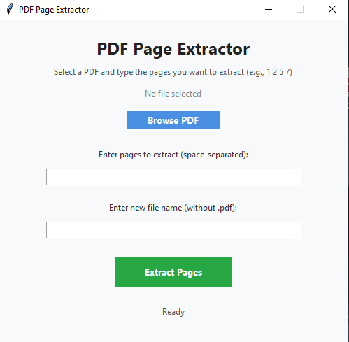
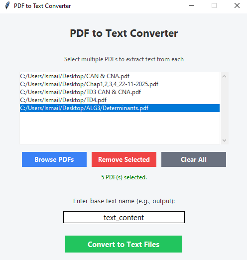

# PYTHONG TOOLS :

### These are useful python tools with a simple UI using tkinter library, in which they help you manipulate PDFs and text files

## EXISTENT TOOLS :

1. Extract text from pdfs
2. Convert Image into PDF
3. Convert Image into text file
4. Extract pages from a PDF (create a sub-PDF-file from the origin one)
5. Contatenate PDF files
6. Color picker

## NOTE !
> You find the result files in the desktop, you can modify the path if you want

## SCREENTSHOTS FROM THE TOOLS :
### Extractor : 


### Converter : 


## HOW TO USE :
### Clone the repository : 
```bash
git clone https://github.com/IsmailMan81F/usefull-tools-python.git
```
### Run the programs :
> .exe programs (No setup)
